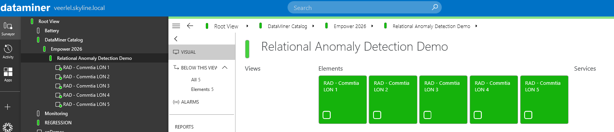

# Empower 2026 - Practical AI Workflows

This package deploys several elements and scripts used throughout the *Practical AI workflows* session at Empower 2026.

During this session, both the **Relational Anomaly Detection** and **Document Intelligence** demos are showcased using the deployed elements and supporting automation scripts.

After installation, the elements will be available under the view *DataMiner Catalog* > *Empower 2026* > *Relational Anomaly Detection Demo*.

The elements included in this package gradually ingest historical data after deployment. To ensure the demo environment is fully prepared, the package should be installed at least 3 hours before the session starts, as the historical data loading process takes approximately three hours to complete.